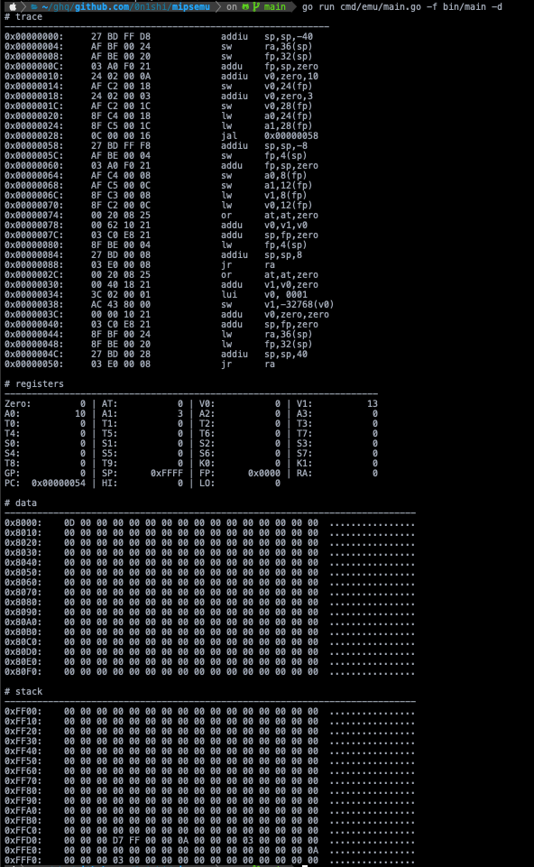

# MIPS Emulator

 

A MIPS1 Emulator written in Golang.

```
NAME:
   Misper - A MIPS CPU Emulator written in Golang

USAGE:
   main [global options] command [command options] [arguments...]

VERSION:
   unset

COMMANDS:
   help, h  Shows a list of commands or help for one command

GLOBAL OPTIONS:
   --file value, -f value  A file path of MIPS binary
   --debug, -d             Running in debug mode (default: false)
   --help, -h              show help (default: false)
   --version, -v           print the version (default: false)
2021/02/11 15:05:34 error: Required flag "file" not set
```

## Example



## Get started

```bash
# compile example c program to generate mips 1 binary at /bin
$ make ex_plus

$ go run cmd/emu/main.go -f bin/main -d
```

## Refs

- [multiarch/crossbuild](https://github.com/multiarch/crossbuild)
- [Linker scripts](https://users.informatik.haw-hamburg.de/~krabat/FH-Labor/gnupro/5_GNUPro_Utilities/c_Using_LD/ldLinker_scripts.html)
- [MIPS architecture overview](https://tams.informatik.uni-hamburg.de/applets/hades/webdemos/mips.html)
- [『はじめて読む MIPS(リローデッド)』 by 中森章](https://www.cqpub.co.jp/interface/TechI/Vol39/app/mips_asm.pdf)
- [Plasma - most MIPS I(TM) opcodes](https://opencores.org/projects/plasma/opcodes)
- [WeMips: Online Mips Emulator](https://rivoire.cs.sonoma.edu/cs351/wemips/)
- [OS Dev - MIPS Overview -](https://wiki.osdev.org/MIPS_Overview)
- [MIPS Options - Using the GNU Compiler Collection (GCC)](https://gcc.gnu.org/onlinedocs/gcc-4.2.4/gcc/MIPS-Options.html)
